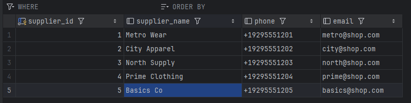
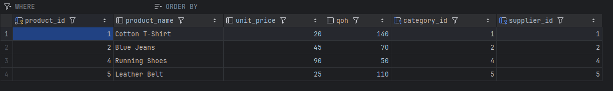
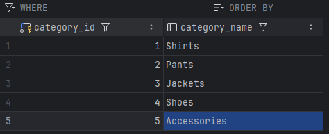
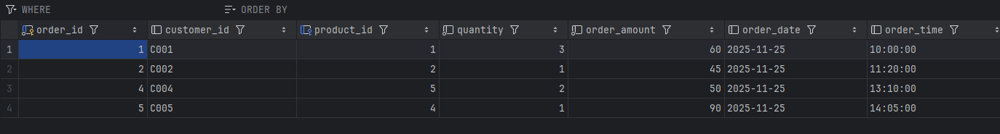

# Retail Inventory Database (CS204 Assignment 1)

The ER diagram shows a normalized retail inventory schema with four core entities (Suppliers, Products, Categories, Orders), their primary keys, foreign key links, and key attributes needed to track stock, catalog structure, and sales.

## Project explanation
This repository fulfills the Study.com Computer Science 204 Assignment 1 requirements by designing and implementing a relational database for a fictional electronics retailer. The work covers entity identification, an ERD that captures PK/FK relationships, and SQL scripts for both structure (DDL) and sample data plus basic mutations (DML). The `sql/create-tables-part1.sql` script defines the schema, while `sql/populatedata-part1.sql` inserts five starter rows per table and includes one update and one delete operation to demonstrate DML changes.

### Entities and relationships
- Suppliers: contact info for each supplier; referenced by Products via `supplier_id`.
- Categories: product taxonomy; referenced by Products via `category_id`.
- Products: inventory items with pricing and quantity on hand; links to both Suppliers and Categories.
- Orders: captures line-level sales with quantities, amounts, and timestamps; references Products.

### Normalization
Normalization is occurring in my database design diagram as we do not have unnecessary joins by leveraging a product table to utilize individual tables that do not store redundant data such as Orders, Suppliers, and Categories. By inspecting the Orders table, we have a product id identifier present that is a foreign key while all the other columns do not have any external dependencies as expected. The reason why product_id is a foreign key is because the information stored on that table is important but not relevant to an order table, the order table only cares for the product id. However now if we inspect the Products table, we can see multiple foreign keys, category_id and supplier_id. Denormalization is a process that can improve efficiency of my normalized database diagram, as it can reduce the need for complex joins within different queries amongst tables to perform business functions. For example in the order table we have order_amount, leveraging unit_price from product and quantity from the orders table we can store the value for this attribute in a denormalized manner as the other option would require us to query for product.unit_price * orders.quantity which is a query that would increase complexity and cause inefficiencies.

In regards to the first normal form (1nf), each table has a primary key with column attributes that hold values. Each row represents a unique item with no repeating groups. Thus satisfies 1nf. Now with 2nf we must ensure that the database design does not have any partial dependencies and in order to satisfy that requirement we do not leverage any composite keys for tables, and in our design we only leverage 1 primary key per table meaning no partial dependencies can occur. Lastly, we satisfy 3nf because none of our or primary key attributes depends on another non key attribute. By leveraging foreign keys we are able to retrieve all relative key attributes without creating any dependency on some other key as the relative key attributes are respective of their primary key. For example category_name is not stored on the product table as it relates to a category_id and not a product_id, so instead we leverage that id in the table so that the mappings are dependent on the primary key.

## Table snapshots
-  A simple supplier directory with IDs, names, phone, and email.
-  Product catalog rows showing category and supplier links plus pricing and quantity on hand.
-  Category reference list mapping IDs to category names.
-  Customer orders with product references, quantities, amounts, and timestamps.
